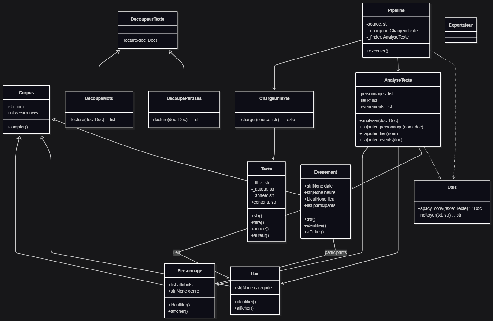
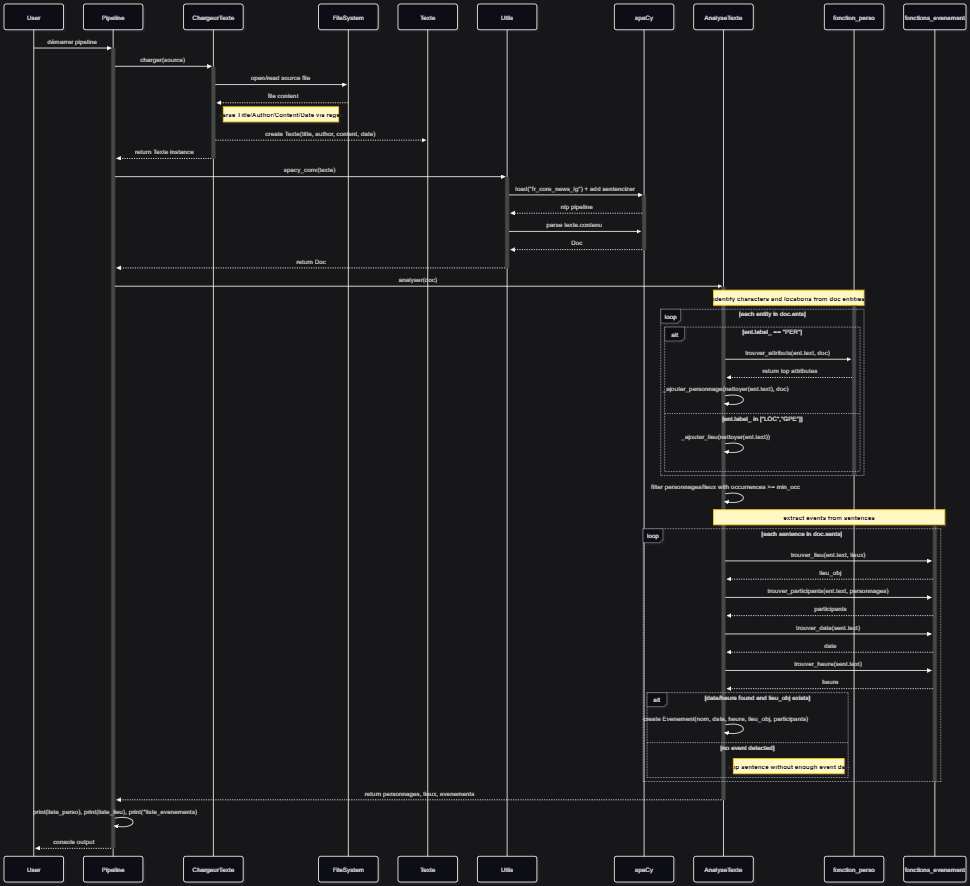

# Extracteur d'Ontologie de Narration (version 0.1)

## UTILISATION

- indiquer si installation de spacy souhaitée
- télécharger fichier depuis Projet Gutenberg en Plain Text
- indiquer chemin et nom du fichier texte à importer

## Fonctionnalités du programme

- lire un texte importé
- reconnaître les éléments ontologiques présents dans le texte selon leur catégorie (Personnage, Lieu, Événement)
- reconnaître les attributs éventuels pour chaque élément
- exporter proprement ces éléments et leurs attributs respectifs dans un fichier .csv

## Création du programme

- Ce programme a été réalisé dans le cadre du cours Programmation orientée objet : Python (SP26)
- Il est le fruit d'une collaboration de cinq étudiants, Clémence Detroyat, Gianni Caporizzo, Nathan Kunz, Guilherme Meireles Pereira et Timoté Sarrasin

## Diagrammes UML de classe et de séquence

